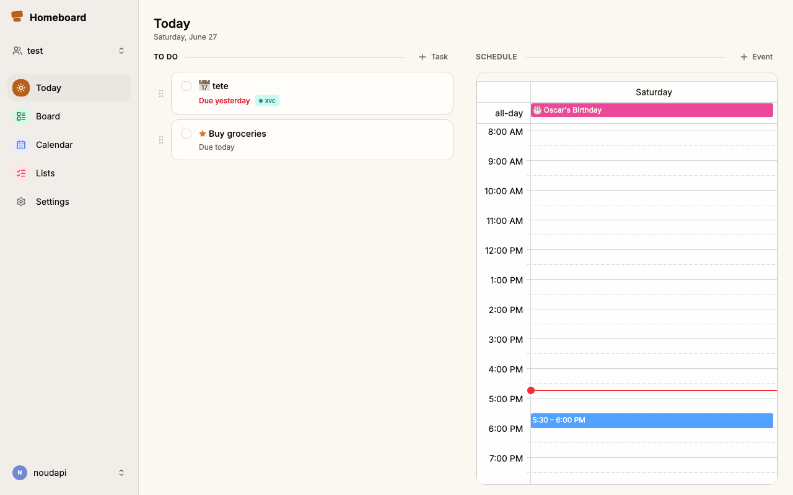
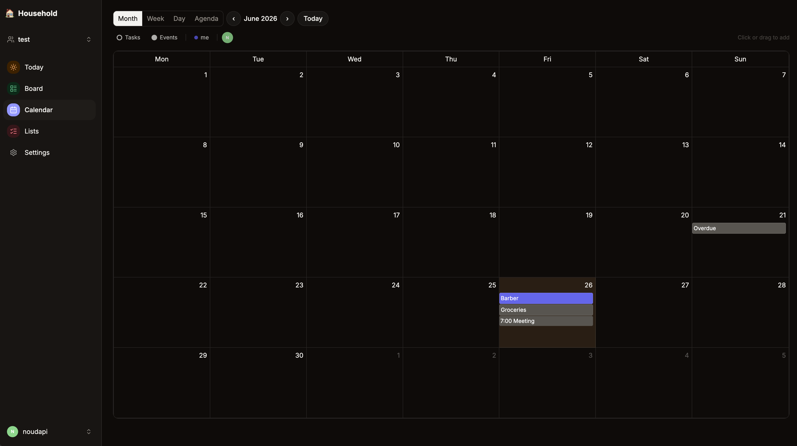
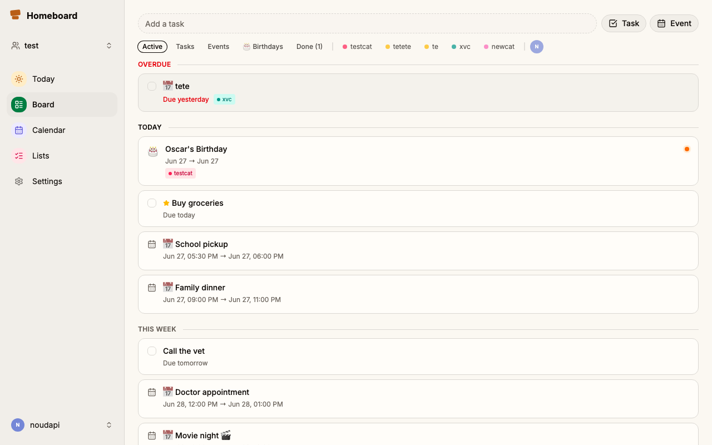
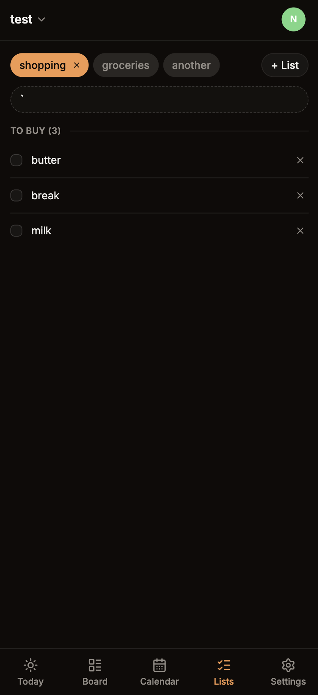

<div align="center">

# 🏠 Homeboard

**A self-hostable family wall — calendar, tasks, and shopping lists in one place.**

Real-time sync across every device. Install as a PWA or native iOS/Android app.

<br/>



<br/><br/>

<table>
  <tr>
    <td align="center">
      <br/>
      <sub><b>Today</b></sub>
    </td>
    <td align="center">
      <br/>
      <sub><b>Calendar</b></sub>
    </td>
    <td align="center">
      <br/>
      <sub><b>Board</b></sub>
    </td>
    <td align="center">
      <br/>
      <sub><b>Lists</b></sub>
    </td>
  </tr>
</table>

</div>

---

## ✨ Features

| | |
|---|---|
| 📅 **Calendar** | Month, week, day, and agenda views; recurring events; birthdays; drag-and-drop |
| ✅ **Tasks** | Due dates, assignees, priority, labels, drag-to-reorder |
| 🛒 **Shopping lists** | Multiple lists, check items off, bulk clear completed |
| ☀️ **Today view** | Overdue items, today's events and tasks in one place |
| ⚡ **Real-time sync** | All changes pushed instantly to every family member via SSE |
| 👶 **Virtual members** | Add kids or non-app members; link to a real account later |
| 🔐 **Roles** | Admin and member roles with access control |
| 📱 **PWA** | Installable on iOS, Android, and desktop — no app store needed |

---

## 🚀 Self-hosting

**Requirements:** Docker and Docker Compose — nothing else.

```bash
git clone https://github.com/your-username/homeboard.git
cd homeboard
cp .env.example .env
# Edit .env — set POSTGRES_PASSWORD and JWT_SECRET at minimum
docker compose up -d
```

The app is now running at `http://localhost:3000`. The API is at `http://localhost:8080`.

### Environment variables

| Variable | Required | Description |
|---|---|---|
| `POSTGRES_PASSWORD` | ✅ | PostgreSQL password |
| `JWT_SECRET` | ✅ | Secret for signing JWTs — use a long random string |
| `API_BASE_URL` | ✅ | Public URL of the backend (e.g. `https://api.yourdomain.com`) |
| `PUBLIC_API_URL` | ✅ | Same value — used by the frontend at runtime |
| `APP_BASE_URL` | | Frontend URL — added to CORS allowed origins |
| `CORS_ALLOWED_ORIGINS` | | Extra CORS origins, comma-separated, or `*` |
| `UPLOAD_DIR` | | Directory for avatar uploads (defaults to `./uploads`) |

### Reverse proxy

Proxy `yourdomain.com` → port `3000` and `api.yourdomain.com` → port `8080`, then set:

```env
API_BASE_URL=https://api.yourdomain.com
PUBLIC_API_URL=https://api.yourdomain.com
APP_BASE_URL=https://yourdomain.com
```

---

## 📱 Installing on your phone

No app store needed — Homeboard works as a PWA.

**iOS (Safari)**
1. Open the app URL in **Safari**
2. Tap **Share** → **Add to Home Screen**
3. Confirm — the icon appears on your home screen

**Android (Chrome)**
1. Open the app URL in **Chrome**
2. Tap **⋮** → **Add to Home Screen** (or tap the install prompt in the address bar)

The app opens full-screen with no browser chrome, just like a native app.

---

## 🏗 Architecture

```
homeboard/
├── backend/    # Go REST API (Postgres, custom JWT auth, SSE)
├── web/        # SvelteKit PWA + Capacitor (iOS/Android)
└── docker-compose.yml
```

- **Backend:** Go · PostgreSQL · `golang-migrate` · Server-Sent Events
- **Frontend:** SvelteKit · Tailwind CSS · shadcn-svelte · Capacitor

---

## 🛠 Development

```bash
# Backend (requires a running Postgres)
cd backend && go run ./cmd/server

# Web
cd web && npm install && npm run dev
```

Copy `.env.example` to `.env` and fill in `DATABASE_URL` and `JWT_SECRET` before starting the backend.

---

## License

MIT
