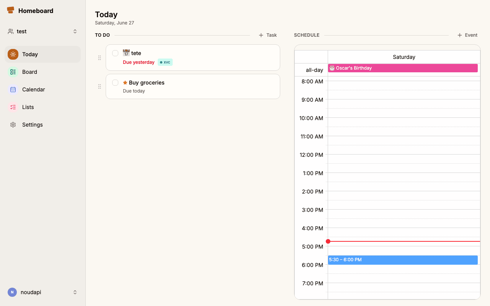
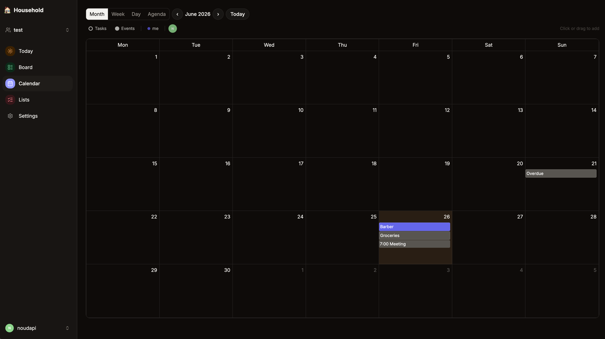
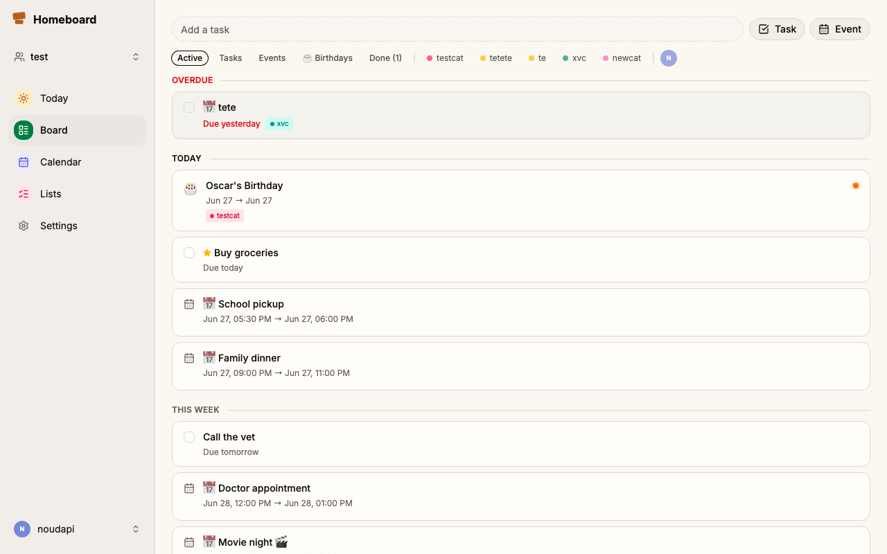
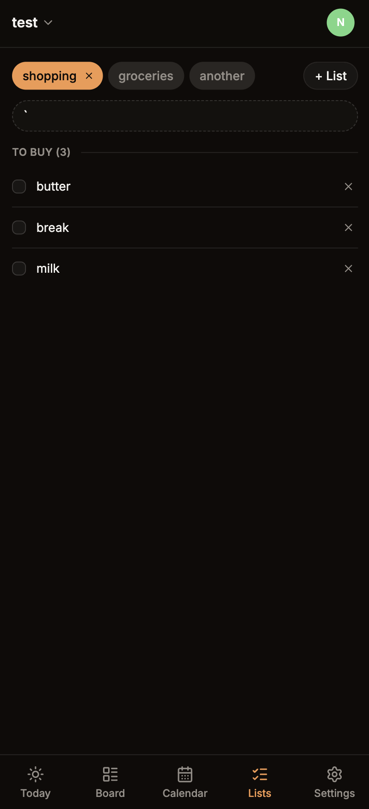

<div align="center">

# 🏠 Homeboard

**A self-hostable family wall — calendar, tasks, and shopping lists in one place.**

Real-time sync across every device. Install as a PWA or native iOS/Android app.

<br/>



<br/><br/>

<table>
  <tr>
    <td align="center">
      <br/>
      <sub><b>Today</b></sub>
    </td>
    <td align="center">
      <br/>
      <sub><b>Calendar</b></sub>
    </td>
    <td align="center">
      <br/>
      <sub><b>Board</b></sub>
    </td>
    <td align="center">
      <br/>
      <sub><b>Lists</b></sub>
    </td>
  </tr>
</table>

</div>

---

## ✨ Features

| | |
|---|---|
| 📅 **Calendar** | Month, week, day, and agenda views; recurring events; birthdays; drag-and-drop |
| ✅ **Tasks** | Due dates, assignees, priority, labels, drag-to-reorder |
| 🛒 **Shopping lists** | Multiple lists, check items off, bulk clear completed |
| ☀️ **Today view** | Overdue items, today's events and tasks in one place |
| ⚡ **Real-time sync** | All changes pushed instantly to every family member via SSE |
| 👶 **Virtual members** | Add kids or non-app members; link to a real account later |
| 🔐 **Roles** | Admin and member roles with access control |
| 🔑 **SSO / OIDC** | Sign in with any OIDC-compliant provider (Authentik, Keycloak, Authelia, Zitadel, ...) |
| 📱 **PWA** | Installable on iOS, Android, and desktop — no app store needed |
| 🔔 **Push notifications** | Get notified when events or tasks are added — Chrome, Firefox, Edge, Android |

---

## 🚀 Self-hosting

**Requirements:** Docker and Docker Compose — nothing else. No need to clone the repo or build anything; `docker compose up` pulls prebuilt images from GHCR.

```bash
mkdir homeboard && cd homeboard
curl -O https://raw.githubusercontent.com/pidanou/homeboard/main/docker-compose.yml
curl -O https://raw.githubusercontent.com/pidanou/homeboard/main/back.env.example
curl -O https://raw.githubusercontent.com/pidanou/homeboard/main/front.env.example
cp back.env.example back.env   # backend + database config
cp front.env.example front.env # frontend config
# Edit both files — set POSTGRES_PASSWORD and JWT_SECRET at minimum
docker compose up -d
```

The app is now running at `http://localhost:3000`. The API is at `http://localhost:8080`.

### Environment variables

Config is split into two files: `back.env` (backend + database) and `front.env` (frontend).

#### `back.env`

| Variable | Required | Description |
|---|---|---|
| `POSTGRES_PASSWORD` | ✅ | PostgreSQL password |
| `JWT_SECRET` | ✅ | Secret for signing JWTs — use a long random string |
| `API_BASE_URL` | ✅ | Public URL of the backend (e.g. `https://api.yourdomain.com`) |
| `APP_BASE_URL` | | Frontend URL — added to CORS allowed origins |
| `CORS_ALLOWED_ORIGINS` | | Extra CORS origins, comma-separated, or `*` |
| `UPLOAD_DIR` | | Directory for avatar uploads (defaults to `./uploads`) |
| `ALLOW_REGISTRATION` | | Set to `true` to re-open registration after the first user exists |
| `ALLOW_MULTI_HOUSEHOLD` | | Set to `true` to allow multiple households per user |
| `ALLOW_PASSWORD_LOGIN` | | Set to `false` to disable email/password login and require OIDC (default `true`) |
| `OIDC_ISSUER_URL` | for OIDC | Issuer URL of your OIDC provider, e.g. `https://auth.example.com/application/o/homeboard/` |
| `OIDC_CLIENT_ID` | for OIDC | OIDC client ID |
| `OIDC_CLIENT_SECRET` | for OIDC | OIDC client secret |
| `OIDC_REDIRECT_URL` | | Override the callback URL — defaults to `${API_BASE_URL}/api/v1/auth/oidc/callback` |
| `OIDC_PROVIDER_NAME` | | Name shown on the login button, e.g. "Authentik" (default `SSO`) |
| `SMTP_HOST` | | SMTP server hostname — leave empty to disable email notifications |
| `SMTP_PORT` | | SMTP port (default: `587`) |
| `SMTP_USER` | | SMTP username |
| `SMTP_PASS` | | SMTP password |
| `SMTP_FROM` | | Sender address (falls back to `SMTP_USER` if empty) |
| `SMTP_TLS` | | Set to `true` for direct TLS (port 465); default uses STARTTLS |
| `VAPID_PUBLIC_KEY` | | Web Push public key (generate below) |
| `VAPID_PRIVATE_KEY` | | Web Push private key |
| `VAPID_SUBJECT` | | Contact URI sent with push requests (e.g. `mailto:admin@example.com`) |

#### `front.env`

| Variable | Required | Description |
|---|---|---|
| `API_URL` | ✅ | Public URL of the backend — must be reachable from the user's browser |
| `ORIGIN` | ✅ | Public URL this frontend is served at — required by SvelteKit to validate form submissions |

---

### Feature flags

| Flag | File | Default | Effect when enabled |
|---|---|---|---|
| `ALLOW_REGISTRATION` | `back.env` | `false` | Re-opens registration after the first user exists |
| `ALLOW_MULTI_HOUSEHOLD` | `back.env` | `false` | Allows users to create more than one household; shows the "New household" button |

Generate VAPID keys once (requires Node):

```bash
npx web-push generate-vapid-keys
```

The command prints something like:

```
Public Key:
BEy2...

Private Key:
abc1...
```

Copy the values into your `.env`:

```env
VAPID_PUBLIC_KEY=BEy2...
VAPID_PRIVATE_KEY=abc1...
VAPID_SUBJECT=mailto:you@yourdomain.com
```

Leave the keys empty to run without push notifications — everything else works normally.

### Creating family accounts

Registration works like Coolify's bootstrap flow:

- **First launch** — the registration page is open. Create your first account; that's your admin.
- **After the first user exists** — registration is automatically closed. Any further attempt returns 403.
- **Need to add more accounts later?** Set `ALLOW_REGISTRATION=true` in your `.env`, restart, register the new accounts, then remove the variable and restart again. **OR** Use the invitation link, invitation links always allows new users to register.

### Email notifications (optional)

Set `SMTP_HOST` to enable transactional emails (login alerts, welcome message, password change notices). If `SMTP_HOST` is empty, emails are silently skipped — no other behaviour changes.

```env
SMTP_HOST=smtp.example.com
SMTP_PORT=587          # 587 = STARTTLS (default), 465 = use with SMTP_TLS=true
SMTP_USER=you@example.com
SMTP_PASS=yourpassword
SMTP_FROM=noreply@example.com   # optional, falls back to SMTP_USER
SMTP_TLS=false
```

### Single sign-on (OIDC, optional)

Homeboard works with any OIDC-compliant identity provider (Authentik, Keycloak, Authelia, Zitadel, ...) — there's no per-provider integration, just a standard OIDC client. Set all three of `OIDC_ISSUER_URL`, `OIDC_CLIENT_ID`, and `OIDC_CLIENT_SECRET` to enable it; leave any one empty to keep it disabled.

1. In your IdP, create a new OIDC/OAuth2 application with:
   - **Redirect URI**: `${API_BASE_URL}/api/v1/auth/oidc/callback` (e.g. `https://api.yourdomain.com/api/v1/auth/oidc/callback`)
   - **Grant type**: Authorization Code (with PKCE if your IdP requires opting in)
   - **Scopes**: `openid email profile`
2. Copy the issuer URL, client ID, and client secret into your `.env`:

```env
OIDC_ISSUER_URL=https://auth.yourdomain.com/application/o/homeboard/
OIDC_CLIENT_ID=your-client-id
OIDC_CLIENT_SECRET=your-client-secret
OIDC_PROVIDER_NAME=Authentik   # shown on the login button, e.g. "Sign in with Authentik"
```

3. Restart the backend — a "Sign in with {provider}" button appears on the login page automatically once discovery succeeds.

Notes:
- The IdP must assert `email_verified: true` — logins with an unverified email are rejected outright, and an existing password account is only auto-linked to an OIDC identity on a verified-email match.
- New OIDC users are still subject to `ALLOW_REGISTRATION` — if registration is closed, only already-known users (or verified-email matches to an existing account) can log in via OIDC.
- Set `ALLOW_PASSWORD_LOGIN=false` to hide the email/password form entirely and go OIDC-only.
- If your reverse proxy rewrites paths (e.g. the API isn't served at the root of its domain), set `OIDC_REDIRECT_URL` explicitly to match what you registered with the IdP.

See `docs/specs/auth.md` for the full flow (PKCE, nonce/state handling, account-linking rules).

### Reverse proxy

Proxy `yourdomain.com` → port `3000` and `api.yourdomain.com` → port `8080`, then set:

```env
API_BASE_URL=https://api.yourdomain.com
PUBLIC_API_URL=https://api.yourdomain.com
APP_BASE_URL=https://yourdomain.com
```

---

## 📱 Installing on your phone

No app store needed — Homeboard works as a PWA.

**iOS (Safari)**
1. Open the app URL in **Safari**
2. Tap **Share** → **Add to Home Screen**
3. Confirm — the icon appears on your home screen

**Android (Chrome)**
1. Open the app URL in **Chrome**
2. Tap **⋮** → **Add to Home Screen** (or tap the install prompt in the address bar)

The app opens full-screen with no browser chrome, just like a native app.

---

## 🏗 Architecture

```
homeboard/
├── backend/    # Go REST API (Postgres, custom JWT auth, SSE)
├── web/        # SvelteKit PWA + Capacitor (iOS/Android)
└── docker-compose.yml
```

- **Backend:** Go · PostgreSQL · `golang-migrate` · Server-Sent Events
- **Frontend:** SvelteKit · Tailwind CSS · shadcn-svelte · Capacitor

---

## 🛠 Development

```bash
# Backend (requires a running Postgres)
cd backend && go run ./cmd/server

# Web
cd web && npm install && npm run dev
```

Copy `.env.example` to `.env` and fill in `DATABASE_URL` and `JWT_SECRET` before starting the backend.

---

## License

MIT
